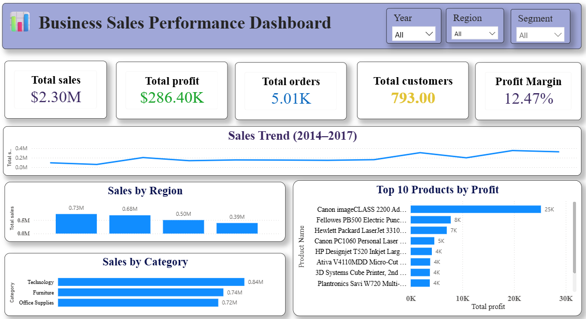
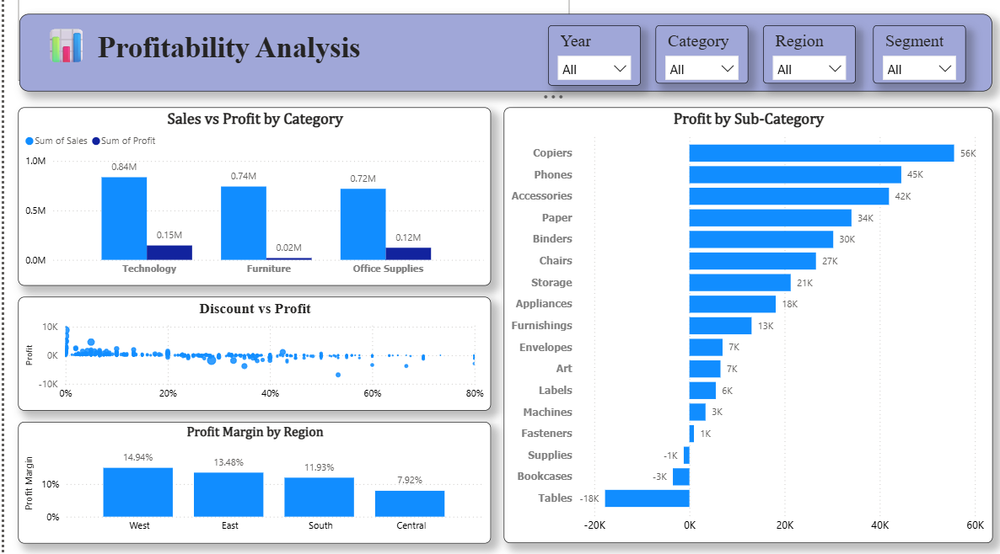

# FUTURE_DS_01 — Business Sales Performance Dashboard

## 📊 Future Interns — Data Science & Analytics Internship

This project was completed as **Task 1** of the Future Interns Data Science & Analytics Internship.

The objective of this project is to analyze retail sales data and create an interactive **Power BI dashboard** to understand sales performance, profitability, regional performance, category performance, and discount impact.

---

## 🎯 Project Objective

The dashboard helps answer the following business questions:

- How are sales changing over time?
- Which regions generate the highest sales and profit?
- Which categories and sub-categories are most profitable?
- Which products generate the highest profit?
- How do discounts affect profitability?
- Which regions have the highest profit margins?

---

## 🛠️ Tools Used

- **Power BI** — Dashboard creation and visualization
- **DAX** — KPI calculations and measures
- **Superstore Sales Dataset** — Retail sales analysis

---

## 📁 Dataset

**Superstore Sales Dataset — Kaggle**

https://www.kaggle.com/datasets/vivek468/superstore-dataset-final

The dataset contains information about orders, customers, products, sales, profit, discounts, categories, regions, and dates.

---

## 📌 Key Performance Indicators

| KPI | Value |
|---|---:|
| Total Sales | $2.30M |
| Total Profit | $286.40K |
| Total Orders | 5,009 |
| Total Customers | 793 |
| Profit Margin | 12.47% |
| Total Quantity | 37,873 |

---

## 📊 Dashboard

### Page 1 — Business Sales Performance Dashboard

The first page provides an executive overview of business performance.

**Includes:**

- Total Sales
- Total Profit
- Total Orders
- Total Customers
- Profit Margin
- Sales Trend (2014–2017)
- Sales by Region
- Sales by Category
- Top 10 Products by Profit
- Year, Region, and Segment filters




### Page 2 — Profitability Analysis

The second page focuses on profitability and business performance.

**Includes:**

- Sales vs Profit by Category
- Profit by Sub-Category
- Discount vs Profit
- Profit Margin by Region
- Year, Category, Region, and Segment filters


---

## 🔎 Key Business Insights

### 1. Technology is the strongest category by profit
Technology is the leading category in terms of profitability and is an important contributor to overall business performance.

### 2. Tables are a major loss-making sub-category
Tables generate significant sales but result in negative profit, indicating a need to review pricing, discounts, costs, and product mix.

### 3. Bookcases and Supplies also show negative profit
These sub-categories should be investigated to identify the reasons behind their losses.

### 4. West is the strongest region
The West region generates the highest overall sales and profit among the four regions.

### 5. Higher discounts are associated with lower profitability
The analysis shows that higher discount levels are generally associated with lower or negative profits.

### 6. Sales increased over time
Sales generally increased from 2014 to 2017, with 2017 recording the highest annual sales.

---

## 💡 Business Recommendations

- Review pricing and discount strategies for loss-making products, especially Tables.
- Control excessive discounting to protect profit margins.
- Focus on high-profit categories and products.
- Investigate loss-making sub-categories and identify pricing or cost issues.
- Analyze the successful performance of the West region and apply useful strategies to other regions.
- Track profit margin along with sales when evaluating business growth.

---
## 📈 DAX Measures

### Total Orders

```DAX
Total Orders =
DISTINCTCOUNT('Sample - Superstore'[Order ID])
```

### Profit Margin 

```DAX
Profit Margin =
 DIVIDE(
SUM('Sample - Superstore'[Profit]),
SUM('Sample - Superstore'[Sales]),
0
)
```
---


### Internship Information
Program: Future Interns — Data Science & Analytics Internship
Task: Task 1 — Business Sales Performance Analytics
Project: Business Sales Performance Dashboard
Internship Period: 28 September 2026 – 28 October 2026
